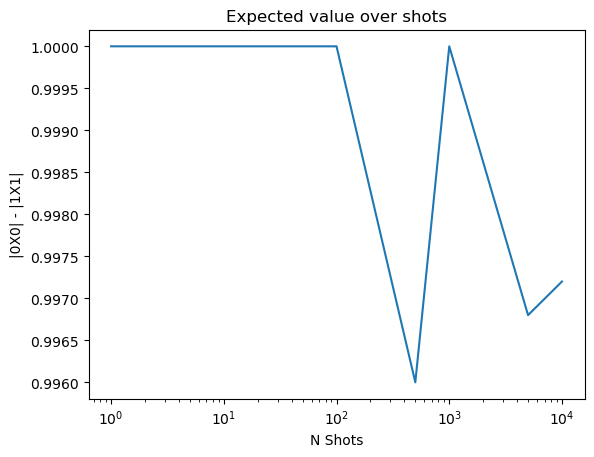

# Convergence test state prep and measurement

1. Running a single qubit and measuring.
2. Increase the number of shots
3. Examine expected value


```python
from pytket.extensions.nexus import Nexus, QuantinuumConfig
#from pytket.extensions.quantinuum import QuantinuumBackend
from pytket.extensions.nexus.backends import NexusBackend
from pytket.backends.resulthandle import ResultHandle
from pytket import Circuit
from pytket.unit_id import BitRegister
from pytket.circuit.display import render_circuit_jupyter
import networkx as nx
import matplotlib.pyplot as plt
import math as ma 
import numpy as np
import random as rm
import pandas as pd
import re
import copy
import warnings
import sympy as sy
import itertools
import ast
```


```python
import helper_functions as hf
import circuits_version_02 as cv2
```


```python
#my_new_quantinuum_exp = Nexus().get_project_by_name("UBQC")
#configuration = QuantinuumConfig(device_name="H1-1E", user_group="Default")
#backend = QuantinuumBackend(configuration, my_new_quantinuum_exp)

my_new_quantinuum_exp = Nexus().get_project_by_name("UBQC")
configuration = QuantinuumConfig(device_name="H1-1E", user_group="Default")
backend = NexusBackend(configuration, my_new_quantinuum_exp)

#from pytket.extensions.quantinuum import QuantinuumBackend, QuantinuumAPIOffline
#api_offline = QuantinuumAPIOffline()
#backend = QuantinuumBackend(device_name="H1-1LE", api_handler = api_offline)
```

    
    Started using project with name: UBQC


```python
circ = Circuit()
qr = circ.add_q_register("q", 1)
cr = circ.add_c_register("c", 1)
index = 0
circ.Measure(qr[index], cr[index])
render_circuit_jupyter(circ)
```


<div style="resize: vertical; overflow: auto; height: 400px; display: block">
    <iframe srcdoc="
&lt;!DOCTYPE html&gt;
&lt;html lang=&#34;en&#34;&gt;
&lt;head&gt;
    &lt;meta charset=&#34;UTF-8&#34;&gt;
    &lt;!-- Download Vue 3--&gt;
&lt;script type=&#34;application/javascript&#34; src=&#34;https://cdn.jsdelivr.net/npm/vue@3&#34;&gt;&lt;/script&gt;
&lt;!-- Download Circuit Renderer with styles --&gt;
&lt;script type=&#34;application/javascript&#34; src=&#34;https://unpkg.com/pytket-circuit-renderer@0.7/dist/pytket-circuit-renderer.umd.js&#34;&gt;&lt;/script&gt;
&lt;link rel=&#34;stylesheet&#34; href=&#34;https://unpkg.com/pytket-circuit-renderer@0.7/dist/pytket-circuit-renderer.css&#34;&gt;
&lt;/head&gt;
&lt;body&gt;


    &lt;div id=&#34;circuit-display-vue-container-c0fa3b94-3f4e-4fa5-9536-265878aca3b1&#34; class=&#34;pytket-circuit-display-container&#34;&gt;
        &lt;div style=&#34;display: none&#34;&gt;
            &lt;div id=&#34;circuit-json-to-display&#34;&gt;{&#34;bits&#34;: [[&#34;c&#34;, [0]]], &#34;commands&#34;: [{&#34;args&#34;: [[&#34;q&#34;, [0]], [&#34;c&#34;, [0]]], &#34;op&#34;: {&#34;type&#34;: &#34;Measure&#34;}}], &#34;created_qubits&#34;: [], &#34;discarded_qubits&#34;: [], &#34;implicit_permutation&#34;: [[[&#34;q&#34;, [0]], [&#34;q&#34;, [0]]]], &#34;phase&#34;: &#34;0.0&#34;, &#34;qubits&#34;: [[&#34;q&#34;, [0]]]}&lt;/div&gt;
        &lt;/div&gt;
        &lt;circuit-display-container
                :circuit-element-str=&#34;&#39;#circuit-json-to-display&#39;&#34;
                :init-render-options=&#34;initRenderOptions&#34;
        &gt;&lt;/circuit-display-container&gt;
    &lt;/div&gt;
    &lt;script type=&#34;application/javascript&#34;&gt;
      const circuitRendererUid = &#34;c0fa3b94-3f4e-4fa5-9536-265878aca3b1&#34;;
      const displayOptions = JSON.parse(&#39;{}&#39;);

      // Script to initialise the circuit renderer app

const { createApp } = Vue;
const circuitDisplayContainer = window[&#34;pytket-circuit-renderer&#34;].default;
// Init variables to be shared between circuit display instances
if (typeof window.pytketCircuitDisplays === &#34;undefined&#34;) {
    window.pytketCircuitDisplays = {};
}
// Create the root Vue component
const app = createApp({
    delimiters: [&#39;[[#&#39;, &#39;#]]&#39;],
    components: { circuitDisplayContainer },
    data () {
      return {
        initRenderOptions: displayOptions,
      }
    }
})
app.config.unwrapInjectedRef = true;
app.mount(&#34;#circuit-display-vue-container-&#34;+circuitRendererUid);
window.pytketCircuitDisplays[circuitRendererUid] = app;
    &lt;/script&gt;


&lt;/body&gt;
&lt;/html&gt;
"
            width="100%" height="100%"
            style="border: none; outline: none; overflow: auto"></iframe>
</div>


```python
n_shots = [1, 5, 10, 50, 100, 500, 1000, 5000, 10000] 
```


```python
with open("handles.txt", "w") as file:
    for n in n_shots:
        circ = Circuit()
        qr = circ.add_q_register("q", 1)
        cr = circ.add_c_register("c", 1)
        index = 0
        circ.Measure(qr[index], cr[index])
        handle = hf.compile_and_submit_job_return_handle(backend, circ, n)
        file.write(str(handle) + "\n")
```


```python
with open("handles.txt") as file:
    lines = [line.rstrip() for line in file]

lines
```


    ["('856bc642-c107-4f4f-93cd-fc557cf89474', 2874667)",
     "('211ed3f7-d383-4092-81f2-e51e02cb3ca7', 2874668)",
     "('0cc0d886-6428-465e-8f00-717817a40db0', 2874669)",
     "('1c2ebd02-4683-49aa-b702-d588aaa2ff7b', 2874670)",
     "('aa433c0e-7291-4c10-aeaa-20085f7b8107', 2874671)",
     "('de97ca23-601a-4cd6-8cca-151fc43c8c57', 2874672)",
     "('719fdc7b-242d-4b17-8b0f-699dacb024ac', 2874673)",
     "('2959cb0f-c5f0-4b9e-8d39-fedd12ccc5b1', 2874674)",
     "('885e9450-fbea-4e22-a121-71009b902d41', 2874675)"]


```python
handle = [ResultHandle.from_str(l) for l in lines]
dist = [backend.get_result(h) for h in handle]
res = [append_missing_for_single_qubit_outcome(d) for d in dist]
expectation = [r[(0,)] - r[(1,)] for r in res]
```


```python
import matplotlib.pyplot as plt

# Data
x = n_shots
y = expectation
# Create a line plot
plt.plot(x, y)
plt.xscale('log')
# Add labels and title
plt.xlabel('N Shots')
plt.ylabel('|0X0| - |1X1|')
plt.title('Expected value over shots')

# Show the plot
plt.savefig('expectation_over_shots.png')
plt.show()


```


    

    


```python

```


```python
max(expectation) - min(expectation)
```


    0.0040000000000000036


```python
def append_missing_for_single_qubit_outcome(result):
    if (0,) in list(result.get_counts().keys()) and (1,) in list(result.get_counts().keys()):
        return result.get_distribution()
    elif (0,) in list(result.get_counts().keys()) and not (1,) in list(result.get_counts().keys()):
        res = result.get_distribution()
        res[(1,)] = 0.0
        return res
    elif not (0,) in list(result.get_counts().keys()) and (1,) in list(result.get_counts().keys()):
        res = result.get_distribution()
        res[(0,)] = 0.0
        return res
    elif not (0,) in list(result.get_counts().keys()) and not (1,) in list(result.get_counts().keys()):
        raise ValueError("No (0,) nor (1,)")
    else:
        raise ValueError("Outcome indices not correct check")
```
